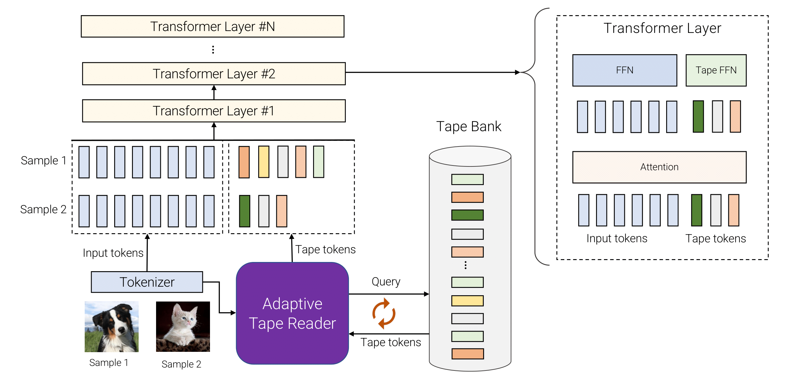

# AdaTape



This repo is the implementation of [AdaTape paper](URL) in JAX.
AdaTape is a strategy that enables dynamic computation in neural networks
via adaptive tape tokens. As shown in the figure, AdaTape employs an elastic
input sequence be equipping an existing architecture with a dynamic read and
write tape. For different samples, we pick a variable number of different
tokens from the tape bank. The tape bank can be driven from input,e.g., by
extracting some extra fine-grained information or it can be a set of trainable
vectors. The Adaptive Tape Reader is used to recursively select different
sequences of tape tokens, with variable length, for different inputs. These
token are then simply appended to inputs and fed to the transformer encoder.

## Reference
If you use AdaTape, please cite the paper.
```
@inproceedings{xue2023adaptive,
  title={Adaptive Computation with Elastic Input Sequence},
  author={Xue, Fuzhao and Likhosherstov, Valerii and Arnab, Anurag and Houlsby, Neil and Dehghani, Mostafa and You, Yang},
  booktitle={International Conference on Machine Learning},
  year={2023}
}
```
