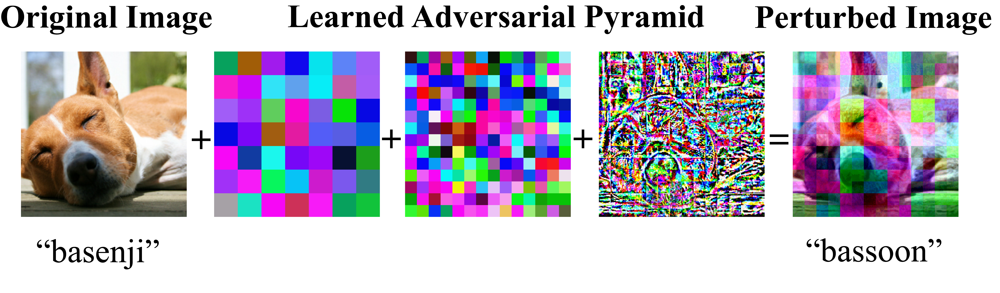

## Pyramid Adversarial Training Improves ViT's Performance



Visual example of a pyramid adversarial image.  We show the original image, multiple scales of a perturbation pyramid, and the perturbed image. The perturbation is adversarially learned for different scales and with different weights for each scale.


Examples of evaluation datasets and our gains. We show thumbnails of in-distribution and out-of-distribution datasets, and the gains from applying our technique on each dataset. (Note that lower is better for ImageNet-C.)

This directory contains the code for [Pyramid Adversarial Training Improves
ViT's Performance](https://pyramidat.github.io/) as well as [Adversarial Examples
Improve Image Recognition](https://arxiv.org/abs/1911.09665).

This project uses adversarial images (with a new pyramid perturbation) in order
to substantially improve ViT's classification performance on ImageNet, both
on in-distribution data and on out-of-distribution data. We also
observe improved performance for other baselines (e.g. MLP-Mixer,
ViT-Discrete) and other pre-trainings (e.g. ImageNet-21k). In addition, these
gains persist after fine-tuning (e.g. different resolutions).

# Paper

[Pyramid Adversarial Training Improves
ViT's Performance](https://arxiv.org/pdf/2111.15121.pdf)

**Abstract:** Aggressive data augmentation is a key component of the strong generalization capabilities of Vision Transformer (ViT). One such data augmentation technique is adversarial training (AT); however, many prior works have shown that this often results in poor clean accuracy. In this work, we present pyramid adversarial training (PyramidAT), a simple and effective technique to improve ViT’s overall performance. We pair it with a “matched” Dropout and stochastic depth regularization, which adopts the same Dropout and stochastic depth configuration for the cleanand adversarial samples. Similar to the improvements on CNNs by AdvProp (not directly applicable to ViT), our pyramid adversarial training breaks the trade-off between in-distribution accuracy and out-of-distribution robustness for ViT and related architectures. It leads to 1.82% absolute improvement on ImageNet clean accuracy for the ViT-B model when trained only on ImageNet-1K data, while simultaneously boosting performance on 7 ImageNet robustness metrics, by absolute numbers ranging from 1.76% to 15.68%. We set a new state-of-the-art for ImageNet-C (41.42 mCE), ImageNet-R (53.92%), and ImageNet-Sketch (41.04%) without extra data, using only the ViT-B/16 backbone and our pyramid adversarial training. Our code will be publicly available.

```
@inproceedings{herrmann2022pyramid,
  title={Pyramid adversarial training improves vit performance},
  author={Herrmann, Charles and Sargent, Kyle and Jiang, Lu and Zabih, Ramin and Chang, Huiwen and Liu, Ce and Krishnan, Dilip and Sun, Deqing},
  booktitle={Proceedings of the IEEE/CVF Conference on Computer Vision and Pattern Recognition},
  pages={13419--13429},
  year={2022}
}
```

# Getting Started

An example command-line to train a ViT B/16 model on ImageNet with three settings (baseline, PixelAT, PyramidAT) is:

```
python scenic/projects/adversarial_training/main.py -- \
  --config=scenic/projects/adversarial_training/configs/imagenet_train/imagenet_regvit_config.py \
  --workdir=pyramidat/
```

# Contact

PyramidAT and this code was done by VisCam in Google Research. If you are
interested, please feel free to contact: irwinherrmann at google.com or deqingsun at google.com

