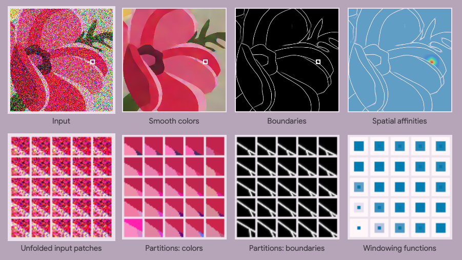

## Boundary Attention



### [Project Page](https://boundaryattention.github.io) | [arXiv](https://arxiv.org/abs/2401.00935) | [Dataset](#kaleidoshapes-dataset)

Boundary Attention is a differentiable model that explicitly models
boundaries—including contours, corners and junctions—using a new mechanism
that we call boundary attention. Our model provides accurate results
even when the boundary signal is very weak or is swamped by noise.

> [**Boundary Attention**](https://arxiv.org/abs/2401.00935),
> Mia Gaia Polansky, Charles Herrmann, Junhwa Hur, Deqing Sun, Dor Verbin, Todd Zickler

### Quick Start

Boundary Attention is written in JAX and uses Scenic framework for training.
For more information on how to install JAX with GPU support,
see [here](https://github.com/google/jax#installation).

To begin, we recommend installing scenic to a new conda virtual environment. If necessary, install anaconda or [miniconda](https://docs.conda.io/projects/miniconda/en/latest/).

```shell
# Create virtual environment with python 3.10 and activate
conda create -n boundary_attention python=3.10 -y
conda activate boundary_attention
# Clone the scenic github repository
git clone https://github.com/google-research/scenic.git
cd scenic
# Install scenic-wide packages
pip install -e .
# Install Boundary Attention specific packages
pip install -r scenic/projects/boundary_attention/requirements.txt

# (Optional) For GPU support:
pip install --upgrade "jax[cuda]" -f https://storage.googleapis.com/jax-releases/jax_cuda_releases.html --force-reinstall
```

 Download the [pretrained weights](#pretrained-weights) and place inside a folder within the boundary attention main folder:

```shell
# Create directories for saving your results and placing the pretrained checkpoint
mkdir scenic/projects/boundary_attention/workdir
mkdir scenic/projects/boundary_attention/pretrained_weights

# Move the checkpoint to the folder
cp ~/Downloads/checkpoint  scenic/projects/boundary_attention/pretrained_weights
```

Then, you can use the following script to test Boundary Attention on new images, replacing `IMAGE_PATH` with a path to any local image.

```shell
PRETRAINED_PATH='scenic/projects/boundary_attention/pretrained_weights/'
IMAGE_PATH='scenic/projects/boundary_attention/noisy_flower.png'
SAVE_PATH='scenic/projects/boundary_attention/workdir/'

python scenic/projects/boundary_attention/helpers/test_new_images.py \
  --weights_dir=${PRETRAINED_PATH} \
  --img_path=${IMAGE_PATH} \
  --save_path=${SAVE_PATH} \
  --height=216 \
  --width=216 \
  --save_raw_output=False
```

The height and width options resize the input image. The option "save_raw_output" toggles whether the entire output from the network is saved to a pickle file.

Alternatively, you can modify this script for Jupyter or Colab.

```python
import PIL
import jax.numpy as jnp
from tensorflow.io import gfile
from scenic.projects.boundary_attention.configs import base_config
from scenic.projects.boundary_attention.helpers import train_utils
from scenic.projects.boundary_attention.helpers import viz_utils

######## MODIFY THE OPTIONS BELOW #########

im_height = 216 # Replace with height to resize input to
im_width = 216  # Replace with width to resize input to

img_path = 'scenic/projects/boundary_attention/noisy_flower.png' # Replace with path to new input
weights_dir = 'scenic/projects/boundary_attention/pretrained_weights/' # Add path to pretrained weights here

############################################

input_img = jnp.array(PIL.Image.open(gfile.GFile(img_path, 'rb')).resize((im_width, im_height)))/255.0
input_img = jnp.expand_dims(input_img.transpose(2,0,1)[:3,:,:], axis=0)

config = base_config.get_config(model_name='boundary_attention',
                                  dataset_name='testing',
                                  input_size=(im_height, im_width, 3))

apply_jitted, trained_params = train_utils.make_apply(config, weights_dir)

outputs = apply_jitted(trained_params['params'], input_img)
viz_utils.visualize_outputs(input_img, outputs)
```

### Pretrained Weights
The pretrained model weights for boundary attention are available in [this Google Drive folder](https://drive.google.com/drive/folders/1VwDx3UUGA_Sh8ax1eWAOzE1xwfu2uKtU?usp=share_link).

### Kaleidoshapes Dataset

To download kaleidoshapes, install the [gcloudCLI](https://cloud.google.com/sdk/docs/install-sdk) and then use:

```shell
# Make new directory to store dataset
mkdir scenic/boundary_attention/kaleidoshapes_dataset

# Copy dataset to directory
gsutil cp -r gs://scenic-bucket/boundary_attention/kaleidoshapes/ scenic/boundary_attention/kaleidoshapes_dataset
```

To generate your own kaleidoshapes dataset or for additional detail on how to use kaleidoshapes see [here](kaleidoshapes/README.md).

### File Structure

A few important model files in this projects are:

- [`boundary_attention_model_base.py`](models/model_lib/boundary_attention_model_base.py) is our base model, which is called by wrapper [`boundary_attention.py`](models/boundary_attention.py)
- [`junction_functions.py`](helpers/junction_functions.py) defines a class to manipulate the model's output junctions and calls [`render_junctions.py`](helpers/render_junctions.py) to render junction patches
- [`params2maps.py`](helpers/params2maps.py) is a wrapper for [`junction_functions.py`](helpers/junction_functions.py)

### Training

Below is an example command-line script to train Boundary Attention on [Kaleidoshapes](#kaleidoshapes-dataset) with this [base config](configs/boundary_attention_model_config.py).

There are two ways to specify dataset and checkpoint locations.
The first is to modify the [base config](configs/base_config.py) so that the parameters defined at the top point to the correct locations.

Here, `_CHECKPOINT_PATH` refers to checkpoints saved during training.
Use `_MODEL_WEIGHTS_PATH` if using the pretrained weights provided.

```python
_CHECKPOINT_PATH = ''  # Leave empty if using pretrained weights
_CHECKPOINT_STEP = -1 # Add step, or leave as -1 for the latest checkpoint
_MODEL_WEIGHTS_PATH = 'scenic/projects/boundary_attention/pretrained_weights/' # Add path to pretrained weights if using, otherwise put ''
_DATASET_DIR = '' # Add path to kaleidoshapes here
_INPUT_SIZE = None # Define to resize data to here (H, W, C) or set to None to use default size
```

Then, create a workdir and train with the following terminal command:

```shell
WORKDIR='scenic/projects/boundary_attention/workdir/' # Modify to point to a desired location
python -m scenic.projects.boundary_attention.main \
  --config=scenic/projects/boundary_attention/configs/base_config.py \
  --workdir=${WORKDIR}
```

Alternatively, specify these settings at train time (this will override changes to `base_config`):

```shell
WORKDIR='scenic/projects/boundary_attention/workdir/'
DATASET_DIR='ADD PATH TO DATASET HERE'
CHECKPOINT_PATH=''
CHECKPOINT_STEP=-1
MODEL_WEIGHTS_PATH='scenic/projects/boundary_attention/pretrained_weights/'

python -m scenic.projects.boundary_attention.main \
  --config=scenic/projects/boundary_attention/configs/base_config.py \
  --workdir=${WORKDIR} \
  --dataset_dir=${DATASET_DIR} \
  --checkpoint_path=${CHECKPOINT_PATH} \
  --checkpoint_step=${CHECKPOINT_STEP} \
  --weights_path=${MODEL_WEIGHTS_PATH}
```

### Evaluation

Below is an example command-line script to evaluate Boundary Attention on Kaleidoshapes.

```shell
WORKDIR='scenic/projects/boundary_attention/workdir/'
DATASET_DIR='ADD PATH TO DATASET HERE'
CHECKPOINT_PATH=''
CHECKPOINT_STEP=-1
MODEL_WEIGHTS_PATH='scenic/projects/boundary_attention/pretrained_weights/'

python -m scenic.projects.boundary_attention.eval_main \
  --config=scenic/projects/boundary_attention/configs/base_config.py \
  --workdir=${WORKDIR} \
  --dataset_dir=${DATASET_DIR} \
  --checkpoint_path=${CHECKPOINT_PATH} \
  --checkpoint_step=${CHECKPOINT_STEP} \
  --weights_path=${MODEL_WEIGHTS_PATH}
```


### Citation
```
@article{mia2024boundaries,
  author    = {Polansky, Mia Gaia and Herrmann, Charles and Hur, Junhwa and Sun, Deqing
              and Verbin, Dor and Zickler, Todd},
  title     = {Boundary Attention: Learning to Localize Boundaries Under High Noise},
  journal   = {arXiv},
  year      = {2024},
  }
```
