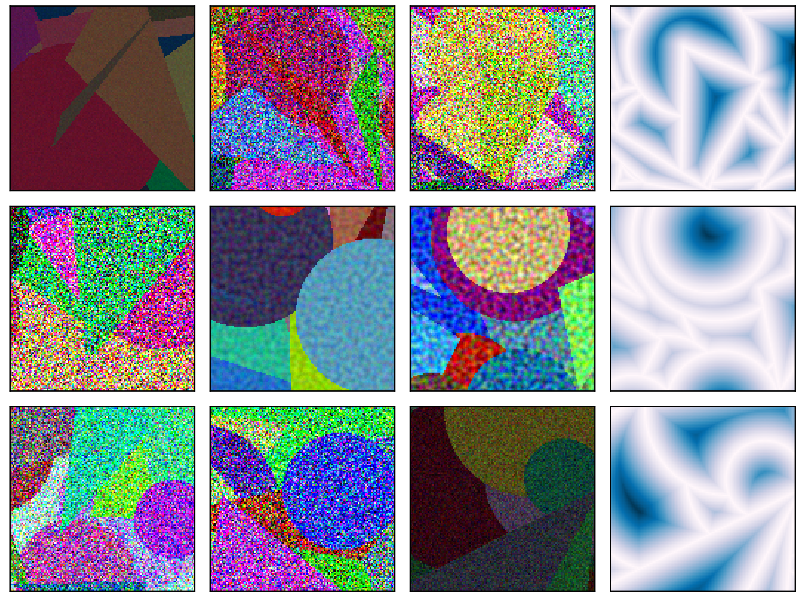

## Kaleidoshapes



### [Project Page](https://boundaryattention.github.io) | [arXiv](https://arxiv.org/abs/2401.00935)

### Download

To download kaleidoshapes, install the [gcloudCLI](https://cloud.google.com/sdk/docs/install-sdk) and then use:

```shell
# Make new directory to store dataset
mkdir scenic/boundary_attention/kaleidoshapes_dataset

# Copy dataset to directory
gsutil cp -r gs://scenic-bucket/boundary_attention/kaleidoshapes/ scenic/boundary_attention/kaleidoshapes_dataset
```

### Quick Start

Begin by installing Scenic and Boundary Attention using the instructions provided by the [Boundary Attention main page]('https://github.com/google-research/scenic/tree/main/scenic/projects/boundary_attention').

Then, install any additional dependencies:

```bash
pip install -r scenic/projects/boundary_attention/kaleidoshapes/requirements.txt
```

You can load kaleidoshapes with the following command:

```python
import tensorflow_datasets as tfds
import scenic.projects.boundary_attention.kaleidoshapes.kaleidoshapes

kaleidoshapes_dir = '' # Add path to kaleidoshapes here
kaleidoshapes_dataset = tfds.load('kaleidoshapes', data_dir=kaleidoshapes_dir, download=False)
```

Note that this loads the original, noiseless images. To crop the images to `125x125` and add noise use:

```python
import ml_collections
import jax

from scenic.projects.boundary_attention.dataset_lib import dataloader
from scenic.projects.boundary_attention.configs import kaleidoshapes_config
from scenic.projects.boundary_attention.dataset_lib.datasets import kaleidoshapes_dataset

batch_size = 5
rng_seed = 0
kaleidoshapes_dir = '' # Add directory here

config = ml_collections.ConfigDict()
config.dataset = kaleidoshapes_config.get_config_kaleidoshapes(kaleidoshapes_dir)
# You can adjust the dataset here, as an example:
# config.dataset.crop_size = (150, 150, 3)
config.batch_size = batch_size
config.eval_batch_size = batch_size

kaleidoshapes_dataset = dataloader.get_dataloader(config, jax.random.PRNGKey(rng_seed))

example_batch = next(kaleidoshapes_dataset.train_iter)
```

### Dataset Generation

To generate an entire dataset, modify the parameters defined at the top of `kaleidoshapes.py` and then run:

```bash
tfds build scenic/projects/boundary_attention/kaleidoshapes/kaleidoshapes.py \
  --register_checksums \
  --data_dir=workdir/ \
```

To generate a single image and visualize with jupyter or colab, you can use:

```python
import matplotlib.pyplot as plt
from scenic.projects.boundary_attention.kaleidoshapes import make_kaleido_image, kaleidoshapes, plot_image

config = kaleidoshapes.ShapesConfig()
ex_image = make_kaleido_image.generate_image(0, config)

# Finally, visualize the output
plot_image.plot_image(ex_image)
```
