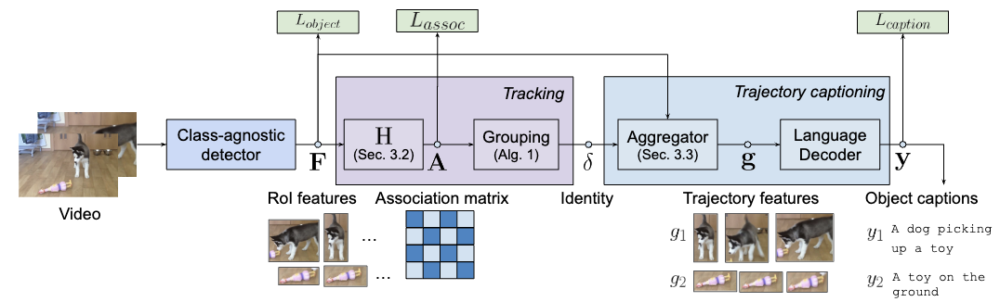

# Dense Video Object Captioning from Disjoint Supervision

> [**Dense Video Object Captioning from Disjoint Supervision**](http://arxiv.org/abs/2306.11729),\
> Xingyi Zhou*, Anurag Arnab*, Chen Sun, Cordelia Schmid.

<p align="center">   </p>

Dense video object captioning (Dense VOC) is the task of detecting, tracking, and captioning object trajectories in a video.
We propose an end-to-end model for the task, and leverage a mixture of disjoint tasks
and datasets that supervise different parts of our model.

## Getting started

First install Scenic following the instructions
[here](https://github.com/google-research/scenic#quickstart).
Then install additional dependencies with:

```
pip install -r scenic/projects/densevoc/requirements.txt
```

Before training and evaluation, we need to set up [TFRecord](https://www.tensorflow.org/tutorials/load_data/tfrecord)
datasets that our data pipeline processes.
Please follow the instructions in `tools/build_*_tfrecord.py` to set up the datasets
for [Visual Genome](https://homes.cs.washington.edu/~ranjay/visualgenome/index.html),
[Spoken Moments-in-Time](http://moments.csail.mit.edu/spoken.html),
[VidSTG](https://github.com/Guaranteer/VidSTG-Dataset),
and [Video Localized Narratives](https://google.github.io/video-localized-narratives/).
The first two are used for pretraining, and the latter two for finetuning and evaluation.

Next, create the COCO-format json annotation files for evaluation following
[tools/create_coco_json_from_tfrecord.py](tools/create_coco_json_from_tfrecord.py).
After that, update the generated data path in [configs/common.py](configs/common.py).

Our model use a [CLIP](https://github.com/openai/CLIP) pretrained checkpoint.
Before training, run [tools/densevoc_convert_clip_b16_weights_to_jax.ipynb](tools/densevoc_convert_clip_b16_weights_to_jax.ipynb)
to convert and download the CLIP weights, and update the path in [configs/common.py](configs/common.py) accordingly.

To train a config, e.g., `densevoc_vidstg`,  run

```shell
python -m scenic.projects.densevoc.main \
--config=scenic/projects/densevoc/configs/densevoc_vidstg.py \
--workdir=./output/densevoc_vidstg/
```

By default, our models are trained on 16 TPU/GPU cores with a total batch size
16 videos (per-device batch size of 1).
It is possible to train with different number of devices and
different batch sizes following the linear learning rate rule.
Training can be done on accelerators with 16GB of memory.

Our model feeds all video frames (up to 200 frames) to the model and produces
trajectories end-to-end, and therefore requires more TPU/GPU memory during inference.
Evaluation on VidSTG requires 32GB of accelerator memory, and we therefore use a separate config
for evaluation.
To perform evaluation on VidSTG, run

```shell
python -m scenic.projects.densevoc.main \
--config=scenic/projects/densevoc/configs/densevoc_vidstg_videoeval.py \
--workdir=./output/densevoc_vidstg/ \
--config.weights=/path/to/checkpoint/densevoc_vidstg
```

## Model Zoo

**Pretrained models**. We report zero-shot evaluation on VidSTG below

|                                                                          |  CHOTA | CapA | AssA | DetA |  mAP   | Checkpoint      |
|--------------------------------------------------------------------------|--------|------|------|------|--------|-----------------|
| [grit_vg_384](configs/grit_vg_384.py)                                    | -      | -    | -    | -    | 17.1   |  Coming soon    |
| [densevoc_disjoint_pretraining](configs/densevoc_disjoint_pretraining.py)| 31.1   | 9.8  | 59.6 | 51.4 | 39.5   |  Coming soon    |

**VidSTG**. These models are finetuned on VidSTG from the pretrained model above.

|                                                                                              |  CHOTA | CapA | AssA | DetA |  mAP  | Checkpoint      |
|----------------------------------------------------------------------------------------------|--------|------|------|------|-------|-----------------|
| [densevoc_vidstg_ftgrit_soft_aggregation](configs/densevoc_vidstg_ftgrit_soft_aggregation.py)| 54.6   | 38.4 | 65.9 | 64.4 | 68.7  | Coming soon     |
| [densevoc_vidstg_ftgrit_hard_aggregation](configs/densevoc_vidstg_ftgrit_hard_aggregation.py)| 54.9   | 39.1 | 65.9 | 64.2 | 68.7  | Coming soon     |
| [densevoc_vidstg](configs/densevoc_vidstg.py)                                                | 56.9   | 39.7 | 70.4 | 65.8 | 71.5  | Coming soon     |

**Video Localized Narratives (VLN)**. These models are finetuned on VLN from the
pretrained model above.

|                                        |  CHOTA | CapA | AssA | DetA |  mAP  | Checkpoint      |
|----------------------------------------|--------|------|------|------|-------|-----------------|
| [densevoc_vln](configs/densevoc_vln.py)| 41.3   | 17.7 | 89.5 | 44.3 | 48.2  | Coming soon     |

## Citation

If you use our Dense VOC project, please cite the following BibTeX entry:

```
@article{zhou2023dense,
  title={Dense Video Object Captioning from Disjoint Supervision},
  author={Zhou, Xingyi and Arnab, Anurag and Sun, Chen and Schmid, Cordelia},
  journal={arXiv:2306.11729},
  year={2023}
}
```
