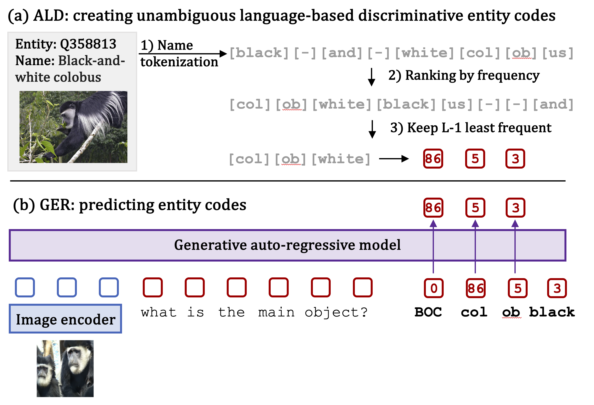

# GER-ALD: A Generative Approach for Wikipedia-Scale Visual Entity Recognition

JAX implementation for visual Generative Entity Recognition (GER) with unAmbiguous Language-based Discriminative (ALD) codes.
For details, see [`arXiv`](https://arxiv.org/abs/2403.02041).



## GER training
Like other projects in Scenic, all model parameters, training sets and datasets are specified using [configuration files](configs).

An example command-line to train our GER-ALD pre-training using this [config file](configs/gerald_pretraining_config.py) is:

```shell
$ python -m scenic.projects.gerald.main \
  --config=scenic/projects/gerald/configs/gerald_pretraining_config.py \
  --workdir=gerald_pretraining/
```

Once the pretraining has finished, you can finetune the resulting checkpoint with the following config.
Note that in the config you should populate the field `config.weights` to point to your pretrained model.
We run this [config file](configs/gerald_finetuning_config.py) in the following way:

```shell
$ python -m scenic.projects.gerald.main \
  --config=scenic/projects/gerald/configs/gerald_finetuning_config.py \
  --workdir=gerald_finetuning/
```


## ALD codes creation
You can create ALD codes by using this [script](prepare_ald_codes.py).
Note that it assumes that you have pre-tokenized the entity names.

## Citation

If you use our `GER-ALD` project, please cite the following BibTeX entry:

```
@inproceedings{caron2024generative,
  title={A generative approach for Wikipedia-scale visual entity recognition},
  author={Caron, Mathilde and Iscen, Ahmet and Fathi, Alireza and Schmid, Cordelia},
  booktitle={Proceedings of the IEEE/CVF Conference on Computer Vision and Pattern Recognition},
  year={2024}
}
```
