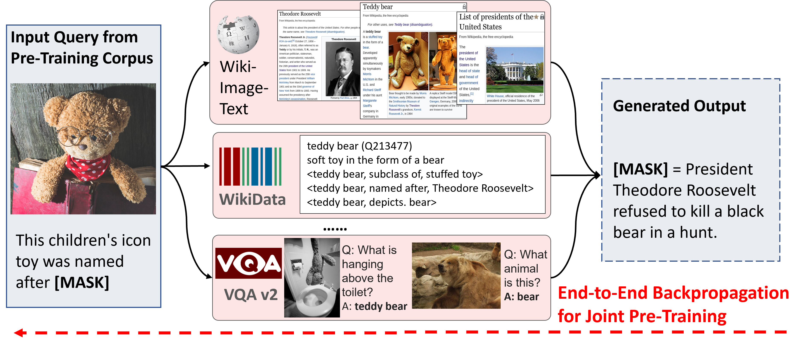

# Repository for REVEAL: Retrieval-Augmented Visual-Language Pre-Training with Multi-Source Multimodal Knowledge Memory



### [Project Page](https://reveal-cvpr.github.io/) | [arXiv](https://arxiv.org/abs/2212.05221)

## What is REVEAL?

We propose an end-to-end Retrieval-Augmented Visual Language Model (REVEAL) that
learns to encode world knowledge into a large-scale memory, and to retrieve from
it to answer knowledge-intensive queries

REVEAL consists of four key components: the memory, the encoder, the retriever
and the generator. The large-scale memory encodes various sources of multimodal
world knowledge (e.g. image-text pairs, question answering pairs, knowledge
graph triplets, etc) via a unified encoder. The retriever finds the most
relevant knowledge entries in the memory, and the generator fuses the retrieved
knowledge with the input query to produce the output. A key novelty in our
approach is that the memory, encoder, retriever and generator are all
pre-trained end-to-end on a massive amount of data. Furthermore, our approach
can use a diverse set of multimodal knowledge sources, which is shown to result
in significant gains. We show that REVEAL achieves state-of-the-art results on
visual question answering (e.g., OKVQA) and image captioning.

More details can be found in the [paper](https://arxiv.org/abs/2212.05221)
published at CVPR 2023 (Highlight).

## Model

The most important model files in this projects are as follow:
- `fusion_in_decoder_soft.py` is our base VL model
- `knowledge_fid.py` is our retrieval-augmented VL (main model), in which:
  - "_dist_mips_across" function is the distributed retrieval operator
  - "fuse_topk_knowledge" function is the attentive-fusion operator
- `local_memory.py` defines the basic data structure of in-memory KB
- `layers.py` defines most neural layers.


## Citation

If you use REVEAL, please use the following BibTeX entry.

```
@inproceedings{reveal,
  title={{REVEAL:} Retrieval-Augmented Visual-Language Pre-Training with Multi-Source Multimodal Knowledge Memory},
  author={Ziniu Hu and
          Ahmet Iscen and
          Chen Sun and
          Zirui Wang and
          Kai{-}Wei Chang and
          Yizhou Sun and
          Cordelia Schmid and
          David A. Ross and
          Alireza Fathi},
  booktitle={CVPR},
  year={2023}
}
```

