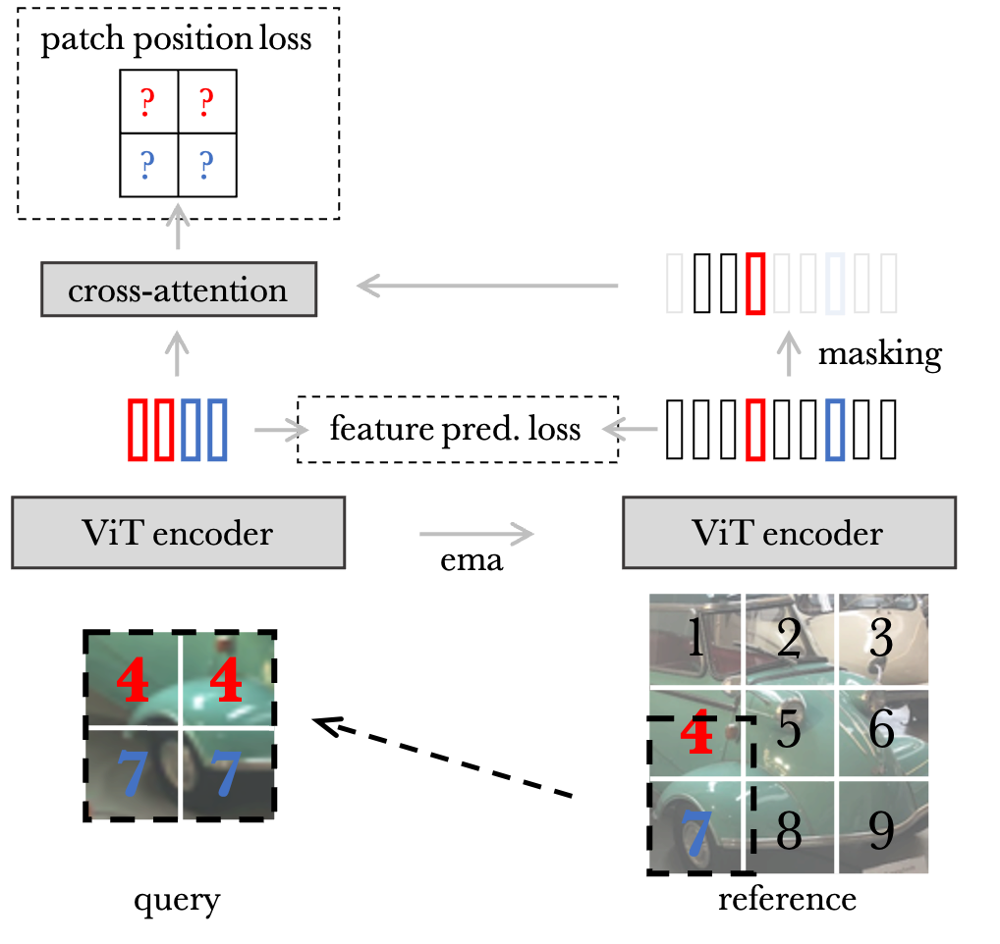

# LOCA: Location-Aware Self-Supervised Vision Transformers for Semantic Segmentation

JAX implementation and pretrained models for LOCA. For details, see [`arXiv`](https://arxiv.org/abs/2212.02400).



## Training
Like other projects in Scenic, all model parameters, training sets and datasets are specified using [configuration files](configs).

An example command-line to train ViT-Base/16 on the ImageNet-1k dataset during 100 epochs using this [config file](configs/loca_imnet1k_base16.py) is:

```shell
$ python -m scenic.projects.loca.main \
  --config=scenic/projects/loca/configs/loca_imnet1k_base16.py \
  --workdir=loca_base/
```

The resulting checkpoint should reach 46.2 mIoU after finetuning on ADE20k dataset with the linear decoder from [Segmenter](https://arxiv.org/abs/2105.05633).

## Model Zoo

<table>
  <tr>
    <th>arch</th>
    <th>data</th>
    <th>mIoU ADE20k</th>
    <th>download</th>
  </tr>
  <tr>
    <td>ViT-S/16</td>
    <td>ImageNet-1k</td>
    <td>44.8</td>
    <td><a href="https://storage.googleapis.com/scenic-bucket/loca/loca_vsmall_imnet1k">checkpoint</a></td>
  </tr>
  <tr>
    <td>ViT-B/16</td>
    <td>ImageNet-1k</td>
    <td>48.0</td>
    <td><a href="https://storage.googleapis.com/scenic-bucket/loca/loca_vbase_imnet1k">checkpoint</a></td>
  </tr>
  <tr>
    <td>ViT-B/16</td>
    <td>ImageNet-21k</td>
    <td>48.5</td>
    <td><a href="https://storage.googleapis.com/scenic-bucket/loca/loca_vbase_imnet21k">checkpoint</a></td>
  </tr>
  <tr>
    <td>ViT-L/16</td>
    <td>ImageNet-21k</td>
    <td>52.3</td>
    <td><a href="https://storage.googleapis.com/scenic-bucket/loca/loca_vlarge_imnet21k">checkpoint</a></td>
  </tr>
  <tr>
    <td>ViT-H/16</td>
    <td>ImageNet-21k</td>
    <td>54.3</td>
    <td><a href="https://storage.googleapis.com/scenic-bucket/loca/loca_vhuge_imnet21k">checkpoint</a></td>
  </tr>
</table>

## Citation

If you use LOCA, please use the following BibTeX entry.

```
@article{caron2022location,
    title={Location-Aware Self-Supervised Vision Transformers for Semantic Segmentation},
    author={Caron, Mathilde and Houlsby, Neil and Schmid, Cordelia},
    journal={arXiv:2212.02400},
    year={2022}
}
```
