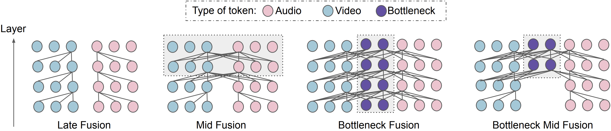

# MBT: Multimodal Bottleneck Transformers

### [Project Page](https://a-nagrani.github.io/mbt.html) | [arXiv](https://arxiv.org/pdf/2107.00135.pdf)



## What is MBT?

MBT is a transformer based model for multimodal fusion in video introduced in ["Attention Bottlenecks for Multimodal Fusion"](https://proceedings.neurips.cc/paper/2021/file/76ba9f564ebbc35b1014ac498fafadd0-Paper.pdf) at NeurIPS 2021. The model
restricts the flow of cross-modal information between latent units through tight
fusion ‘bottlenecks’, that force the model to collect and ‘condense’ the most
relevant inputs in each modality. Here the model is applied to RGB and
spectrogram patches directly. More details can be found in the [paper](https://proceedings.neurips.cc/paper/2021/file/76ba9f564ebbc35b1014ac498fafadd0-Paper.pdf).

## Datasets

MBT achivies state-of-the-art results for video classification across a number
of popular audio-visual benchmarks, including AudioSet, Epic-Kitchens100, and
VGGSound.

## Training

The following command will install the required packages for MBT:
```shell
$ pip install -r scenic/projects/mbt/requirements.txt
```

Like other projects in Scenic, all model parameters, training sets and datasets are specified using [configuration files](configs).
Which modalities to train on (RGB only, spectrogram only, or RGB+spectrogram) is also specified in the config file.

To train a model, please download a pretrained ViT image model trained using
[Scenic](https://github.com/google-research/scenic/tree/main/scenic/projects/baselines)
or the [original implementation](https://github.com/google-research/vision_transformer).

Additionally, pre-process the training dataset in the same way as done by the ViViT project [here](https://github.com/google-research/scenic/tree/main/scenic/projects/vivit/data/data.md). Spectrograms must be
extracted following the details in Sec. 4.2 of the [paper](https://proceedings.neurips.cc/paper/2021/file/76ba9f564ebbc35b1014ac498fafadd0-Paper.pdf).

An example command-line to train MBT-B/16x2 on the balanced AudioSet dataset (AS-mini in the paper)
using this [config file](configs/audioset/balanced_audioset_base.py)
is

```shell
$ python -m scenic.projects.mbt.main \
  --config=scenic/projects/mbt/configs/audioset/balanced_audioset_base.py \
  --workdir=mbt_base/
```


## Model Zoo

We release some pretrained MBT models trained under different settings. Checkpoints are provided as Scenic checkpoints compatible with
[Flax](https://github.com/google/flax). AS-mini and AS-500K refer to different AudioSet training splits as described in the [paper](https://proceedings.neurips.cc/paper/2021/file/76ba9f564ebbc35b1014ac498fafadd0-Paper.pdf).
Note that the numbers are likely to fluctuate slightly as the test set for this dataset varies when videos are taken down.


| Model           | Modalities  | Dataset       | mAP | Checkpoint                                                                                                                                                                                                                                         |
|:------------:|:-----------:|:------------:|:---:|:----------------------------------------------------------------------------------------------------------------:|
| MBT-B | Spec  | AS-mini          |   30.9 | [Checkpoint](https://storage.googleapis.com/scenic-bucket/mbt/mbtb32_as-mini_spec)  |
| MBT-B | RGB  | AS-mini          | 27.0  | [Checkpoint](https://storage.googleapis.com/scenic-bucket/mbt/mbtb32_as-mini_rgb)  |
| MBT-B | RGB+Spec  | AS-mini           |  43.9   | [Checkpoint](https://storage.googleapis.com/scenic-bucket/mbt/mbtb32_as-mini_rgb-spec)  |
| MBT-B | Spec  | AS-500k          | 44.0   | [Checkpoint](https://storage.googleapis.com/scenic-bucket/mbt/mbtb32_as-500k_spec)  |
| MBT-B | RGB | AS-500K           |  33.9   | [Checkpoint](https://storage.googleapis.com/scenic-bucket/mbt/mbtb32_as-500k_rgb)  |
| MBT-B | RGB+Spec | AS-500K           |  52.3  | [Checkpoint](https://storage.googleapis.com/scenic-bucket/mbt/mbtb32_as-500k_rgb-spec)  |


## Citation

If you use MBT, please use the following BibTeX entry.

```
@InProceedings{nagrani2021mbt,
  title={Attention Bottlenecks for Multimodal Fusion},
  author={Nagrani, Arsha and Yang, Shan and Arnab, Anurag and Jansen, Aren and Schmid, Cordelia and Sun, Chen},
  booktitle={Advances in Neural Information Processing Systems (NeurIPS)},
  year={2021}
}
```


