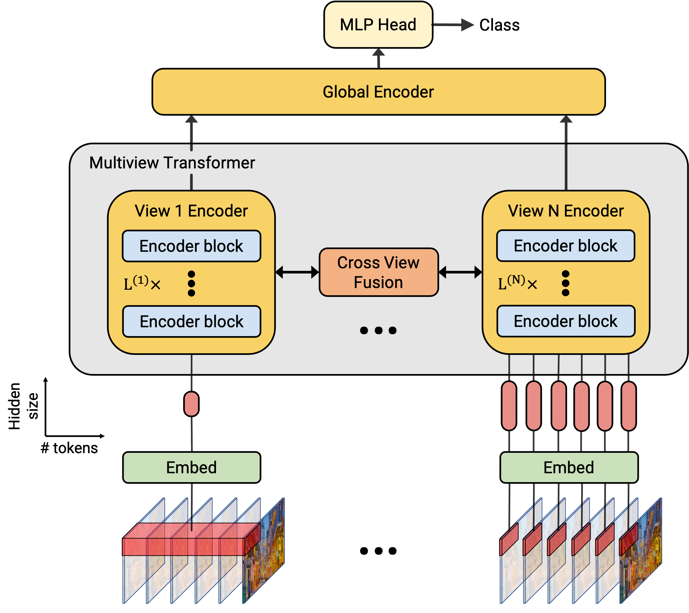

# Multiview Transformers for Video Recognition (MTV)



MTV consists of separate encoders to represent different views of the input
video with lateral connections and a global encoder to fuse information
across views. Details can be found in the [paper](https://arxiv.org/abs/2201.04288).

## Getting Started
The following command will install the required packages for MTV:
```shell
$ pip install -r scenic/projects/mtv/requirements.txt
```

## Training a MTV Model

#### Datasets

Data-loaders for popular academic datasets including Kinetics, Moments in Time,
Epic Kitchens and Something-Something v2 are included in Scenic.
To pre-process these datasets, follow the same steps as ViViT outlined [here](https://github.com/google-research/scenic/blob/main/scenic/projects/vivit/data/data.md).

#### Training
MTV models and training jobs are defined by [configuration files](configs).

To train a model, please download a pretrained ViT image model trained using
[Scenic](https://github.com/google-research/scenic/tree/main/scenic/projects/baselines)
or the [original implementation](https://github.com/google-research/vision_transformer).

An example command-line to train a MTV-B model with cross view attention on
Kinetics using this [config file](configs/kinetics/k400_mtv_b2_cva.py)
is

```shell
$ python -m scenic.projects.mtv.main \
  --config=scenic/projects/mtv/configs/kinetics/k400_mtv_b2_cva.py \
  --workdir=mtv_base_cva/
```

## Model Zoo

The following table contains pretrained MTV models trained on various datasets.
Checkpoints are provided as Scenic checkpoints compatible with
[Flax](https://github.com/google/flax).

Accuracy is reported from "multi-view evaluation", as common in the literature.
In the table below, `x * y` denotes `x` temporal views, and `y` spatial views.
All the models below take in 32 frames as input.


| Model           | Dataset       | Top 1 Accuracy | Views | Config                                                                                                             | Checkpoint                                                                                                                                                                                                                                         |
|:------------:|:-----------:|:------------:|:---:|:----------------------------------------------------------------------------------------------------------------:|:------------------------------------------------------------------------------------------------------------------------------------------------------------------------------------------------------------------------------------------------:|
| MTV-B    | Kinetics 400     | 81.8           | 4x3   | [config](configs/kinetics/k400_mtv_b2_cva.py)                                   | [Checkpoint](https://storage.googleapis.com/scenic-bucket/mtv/mtv_b_k400) |
| MTV-B    | Kinetics 600     | 83.8           | 4x3   | [config](configs/kinetics/k600_mtv_b2_cva.py)                                   | [Checkpoint](https://storage.googleapis.com/scenic-bucket/mtv/mtv_b_k600) |
| MTV-B    | Kinetics 700     | 73.5           | 4x3   | [config](configs/kinetics/k700_mtv_b2_cva.py)                                   | [Checkpoint](https://storage.googleapis.com/scenic-bucket/mtv/mtv_b_k700) |
| MTV-B    | Epic-Kitchens 100 (finetuned from Kinetics 400)     | 46.7 (Action)           | 4x1   | [config](configs/epic_kitchens/epic_mtv_b2_cva.py)                                   | [Checkpoint](https://storage.googleapis.com/scenic-bucket/mtv/mtv_b_ek_k400) |
| MTV-B    | Epic-Kitchens 100 (finetuned from Kinetics 700)     | 48.0 (Action)           | 4x1   | [config](configs/epic_kitchens/epic_mtv_b2_cva.py)                                   | [Checkpoint](https://storage.googleapis.com/scenic-bucket/mtv/mtv_b_ek_k700) |
| MTV-L    | Kinetics 600     | 84.4           | 4x3   | [config](configs/kinetics/k600_mtv_l2_cva.py)                                   | [Checkpoint](https://storage.googleapis.com/scenic-bucket/mtv/mtv_l_k600) |
| MTV-L    | Kinetics 700     | 75.2           | 4x3   | [config](configs/kinetics/k700_mtv_l2_cva.py)                                   | [Checkpoint](https://storage.googleapis.com/scenic-bucket/mtv/mtv_l_k700) |
| MTV-L    | Moments in Time  | 42.5           | 1x3   | [config](configs/mit/mit_mtv_l2_cva.py)                                   | [Checkpoint](https://storage.googleapis.com/scenic-bucket/mtv/mtv_l_mit) |


## Questions

For any questions, contact xxman@google.com or shawnyanyuv@gmail.com.
