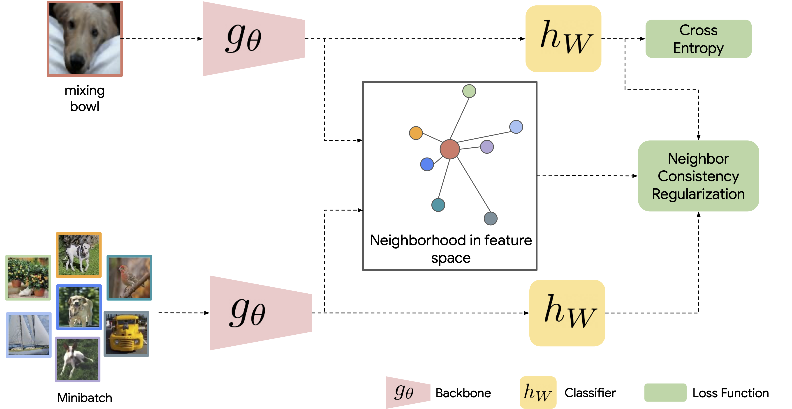

NCR: Learning with Neighbor Consistency for Noisy Labels
==


NCR is a regularization method which encourages the network to make similar
predictions for similar vectors in the feature space.
Details can be found in the [paper](https://arxiv.org/abs/2202.02200), where we
used this method to learn with noisy labels.


## Getting Started
The following command will install the required packages for NCR:
```shell
$ pip install -r scenic/projects/ncr/requirements.txt
```

## Experiments in Controlled Noisy Labels Dataset
We added [Controlled Noisy Web Labels](https://google.github.io/controlled-noisy-web-labels/index.html) to [TFDS](https://www.tensorflow.org/datasets/catalog/controlled_noisy_web_labels)
as a part of this release. We recommend using `tfds-nightly` and `tf-nightly-gpu` libraries for this code. Please follow the manual download [instructions](https://www.tensorflow.org/datasets/catalog/controlled_noisy_web_labels) to set up the dataset.

Training configurations for different noise ratios are defined in [configuration files](configs).
An example command-line to train a ResNet18 with NCR in mini-ImageNet-Red with 20% noise
using this [config file](configs/mini_imagenet_blue_ncr_train20.py)
is

```shell
$ python -m scenic.projects.ncr.main \
  --config=scenic/projects/ncr/configs/mini_imagenet_blue_ncr_train20.py \
  --workdir=mini_imagenet_red_ncr_20/
```

Note that the original code for the [paper](https://arxiv.org/abs/2202.02200) was written in TensorFlow, and this repository contains its re-implementation in JAX.
The original Tensorflow version contained a bug when resizing
the images for mini-ImageNet-Red and mini-ImageNet-Blue datasets. This bug has
been fixed in this version. The following results should be obtained by running the code.
These results have been updated in the latest Arxiv version of the
[paper](https://arxiv.org/abs/2202.02200).

## mini-ImageNet-Red Results


| Method                  | 0% Noise | 20% Noise | 40% Noise | 80% Noise |
|-------------------------|----------|-----------|-----------|-----------|
| Standard                | 70.9     | 66.9      | 63.0      | 49.3      |
| Mixup                   | 70.5     | 67.6      | 63.8      | 48.7      |
| Bootstrap               | 71.1     | 67.4      | 63.4      | 48.8      |
| Bootstrap + Mixup       | 69.9     | 66.7      | 62.0      | 42.2      |
| Label Smoothing         | 71.2     | 68.2      | 64.2      | 50.2      |
| Label Smoothing + Mixup | 71.1     | 68.3      | 63.8      | 47.3      |
| **Ours: NCR**           | **72.1** | **69.0**  | **64.6**  | **51.2**  |
| **Ours: NCR + Mixup**   | 71.7     | 68.6      | 64.5      | 48.9      |

## mini-ImageNet-Blue Results

| Method                  | 0% Noise | 20% Noise | 40% Noise | 80% Noise |
|-------------------------|----------|-----------|-----------|-----------|
| Standard                | 72.7     | 63.4      | 55.9      | **13.4**  |
| Mixup                   | 72.6     | 66.5      | 59.4      | 7.8       |
| Bootstrap               | 72.8     | 66.5      | 57.4      | **13.4**  |
| Bootstrap + Mixup       | 71.7     | 64.6      | 53.2      | 7.6       |
| Label Smoothing         | 73.0     | 67.7      | 60.6      | 9.1       |
| Label Smoothing + Mixup | 72.5     | 67.9      | 60.9      | 6.8       |
| **Ours: NCR**           | **73.4** | 67.8      | 60.6      | 11.5      |
| **Ours: NCR + Mixup**   | 73.1     | **68.3**  | **61.4**  | 7.1       |


## Reference

Please use the following BibTeX entry for citing our paper:

```
@inproceedings{iscen2022ncr,
  title={Learning with Neighbor Consistency for Noisy Labels},
  author={Iscen, Ahmet and Valmadre, Jack and Arnab, Anurag and Schmid, Cordelia},
  booktitle={Proceedings of the IEEE/CVF Conference on Computer Vision and Pattern Recognition},
  year={2022}
}
```

## Questions

For any questions, contact iscen@google.com.
