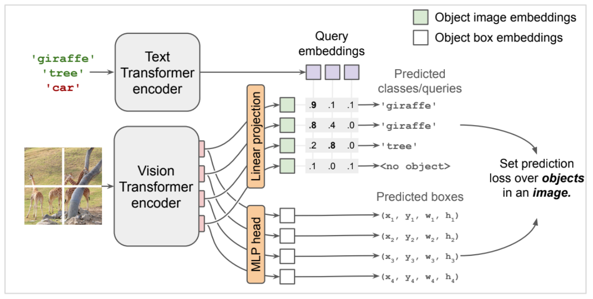
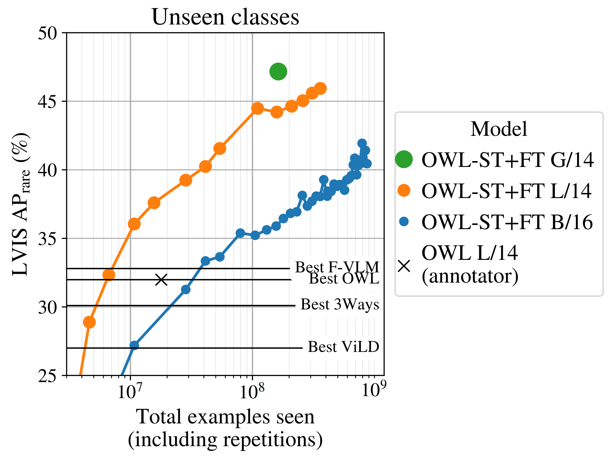
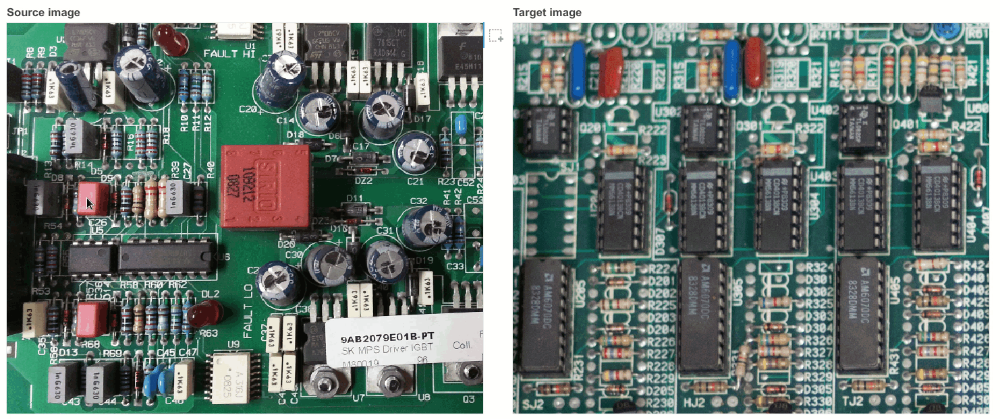
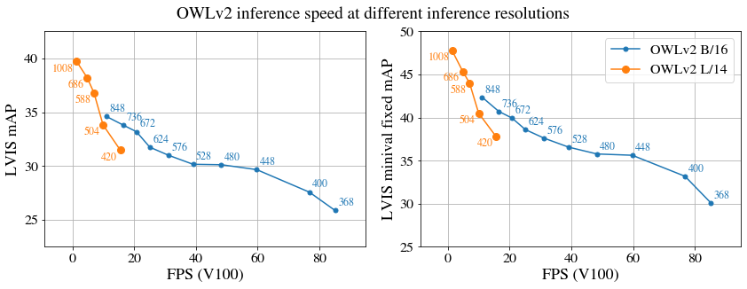

OWL-ViT: Open-World Object Detection with Vision Transformers
==




OWL-ViT is an **open-vocabulary object detector**. Given an image and a free-text query, it finds objects matching that query in the image. It can also do **one-shot object detection**, i.e. detect objects based on a single example image. OWL-ViT reaches state-of-the-art performance on both tasks, e.g. **44.6% zero-shot LVIS APr** with a OWLv2 ViT-L/14 backbone.

<!--- General reference links --->
[Minimal Colab]: https://colab.research.google.com/github/google-research/scenic/blob/main/scenic/projects/owl_vit/notebooks/OWL_ViT_minimal_example.ipynb
[Playground Colab]: https://colab.research.google.com/github/google-research/scenic/blob/main/scenic/projects/owl_vit/notebooks/OWL_ViT_inference_playground.ipynb

[[OWL-ViT v1 Paper]](https://arxiv.org/abs/2205.06230)
[[OWL-ViT v2 Paper]](https://arxiv.org/abs/2306.09683)
[[Minimal Colab]]
[[Playground Colab]]

**Update (2024-02-13):** Added support for changing image size at inference. Also added [information about speed benchmarking](#inference-speed) to the README and the [Minimal Colab].
<br>
**Update (2023-09-25):** Added image-conditioned detection example to the [Minimal Colab]
<br>
**Update (2023-09-22):** Added code and checkpoints for OWL-ViT v2.
<br>
**Update (2023-03-21):** Added a new checkpoint with a segmentation mask head. See the [Minimal Colab] for a usage example.
<br>
**Update (2022-10-14):** Added [training](#training) and [evaluation](#evaluation) code.
<br>
**Update (2022-07-06):** Extended TensorFlow-conversion [Colab](https://colab.research.google.com/github/google-research/scenic/blob/main/scenic/projects/owl_vit/notebooks/OWL_ViT_Export_JAX_model_to_TensorFlow_SavedModel.ipynb) with examples for conversion to TFLite.
<br>
**Update (2022-06-22):** Added [Playground Colab] for interactive exploration of the model, including image-conditioned detection.
<br>
**Update (2022-05-31):** Added [Colab](https://colab.research.google.com/github/google-research/scenic/blob/main/scenic/projects/owl_vit/notebooks/OWL_ViT_Export_JAX_model_to_TensorFlow_SavedModel.ipynb) showing how to export models to TensorFlow.

## Contents
Below, we provide pretrained checkpoints, example Colabs, training code and evaluation code.

To get started, check out the [Minimal Colab], which shows all steps necessary for running inference, including installing Scenic, instantiating a model, loading a checkpoint, preprocessing input images, getting predictions, and visualizing them.

Table of contents:

* [Model versions](#model-versions)
* [Pretrained checkpoints](#pretrained-checkpoints)
* [Colabs](#colabs)
  * [Minimal example](#minimal-example)
  * [Inference playground](#inference-playground)
  * [Conversion to TensorFlow](#conversion-to-tensorflow)
* [Installation](#installation)
* [Training](#training)
* [Evaluation](#evaluation)
* [Inference speed](#inference-speed)
* [License](#license)
* [References](#references)

## Model versions

### OWL-ViT v1
The original OWL-ViT model was introduced in May 2022 and is described in [Simple Open-Vocabulary Object Detection with Vision Transformers](https://arxiv.org/abs/2205.06230).

### OWL-ViT v2
In June 2023, we introduced an improved architecture and training recipe that uses self-training on Web image-text data as described in [Scaling Open-Vocabulary Object Detection](https://arxiv.org/abs/2306.09683). **OWL-ViT v2 checkpoints are drop-in replacements for v1.** The core inference architecture of v2 is identical to v1, except that v2 adds an **objectness prediction head** which predicts the (query-agnostic) likelihood that a predicted box contains an object (as opposed to background). The objectness score can be used to rank or filter predictions independently of text queries.

OWL-ViT v2 performs significantly better than OWL-ViT v1:




## Pretrained checkpoints

OWL-ViT models and their pre-trained checkpoints are specified in [configuration files](https://github.com/google-research/scenic/blob/main/scenic/projects/owl_vit/configs). Checkpoint files are compatible with [Flax](https://github.com/google/flax). We provide the following variants, both as JAX/Flax checkpoints and as `tf.SavedModel`s:

<!--- Reference links for configs --->
[v1_b32_config]: https://github.com/google-research/scenic/blob/main/scenic/projects/owl_vit/configs/clip_b32.py
[v1_b16_config]: https://github.com/google-research/scenic/blob/main/scenic/projects/owl_vit/configs/clip_b16.py
[v1_l14_config]: https://github.com/google-research/scenic/blob/main/scenic/projects/owl_vit/configs/clip_l14.py
[v1_l14m_config]: https://github.com/google-research/scenic/blob/main/scenic/projects/owl_vit/configs/clip_l14_with_masks.py
[v2_b16_config]: https://github.com/google-research/scenic/blob/main/scenic/projects/owl_vit/configs/owl_v2_clip_b16.py
[v2_l14_config]: https://github.com/google-research/scenic/blob/main/scenic/projects/owl_vit/configs/owl_v2_clip_l14.py

<!--- Reference links for Jax checkpoints --->
[v1_b32_jax]: https://storage.googleapis.com/scenic-bucket/owl_vit/checkpoints/clip_vit_b32_b0203fc
[v1_b16_jax]: https://storage.googleapis.com/scenic-bucket/owl_vit/checkpoints/clip_vit_b16_6171dab
[v1_l14_jax]: https://storage.googleapis.com/scenic-bucket/owl_vit/checkpoints/clip_vit_l14_d83d374
[v1_l14m_jax]: https://storage.googleapis.com/scenic-bucket/owl_vit/checkpoints/clip_vit_l14_with_masks_6c17944
[v2_b16_st_jax]: https://storage.googleapis.com/scenic-bucket/owl_vit/checkpoints/owl2-b16-960-st-ngrams_c7e1b9a
[v2_b16_st_ft_jax]: https://storage.googleapis.com/scenic-bucket/owl_vit/checkpoints/owl2-b16-960-st-ngrams-ft-lvisbase_d368398
[v2_b16_ens_jax]: https://storage.googleapis.com/scenic-bucket/owl_vit/checkpoints/owl2-b16-960-st-ngrams-curated-ft-lvisbase-ens-cold-weight-05_209b65b
[v2_l14_st_jax]: https://storage.googleapis.com/scenic-bucket/owl_vit/checkpoints/owl2-l14-1008-st-ngrams_0881fd6
[v2_l14_st_ft_jax]: https://storage.googleapis.com/scenic-bucket/owl_vit/checkpoints/owl2-l14-1008-st-ngrams-ft-lvisbase_8ca674c
[v2_l14_ens_jax]: https://storage.googleapis.com/scenic-bucket/owl_vit/checkpoints/owl2-l14-1008-st-ngrams-ft-lvisbase-ens-cold-weight-04_8ca674c

<!--- Reference links for tf.SavedModels --->
[v1_b32_tf]: https://storage.googleapis.com/scenic-bucket/owl_vit/checkpoints/clip_vit_b32_b0203fc_tf_model
[v1_b16_tf]: https://storage.googleapis.com/scenic-bucket/owl_vit/checkpoints/clip_vit_b16_6171dab_tf_model
[v1_l14_tf]: https://storage.googleapis.com/scenic-bucket/owl_vit/checkpoints/clip_vit_l14_d83d374_tf_model
[v2_b16_st_tf]: https://storage.googleapis.com/scenic-bucket/owl_vit/checkpoints/owl2-b16-960-st-ngrams_tf_model
[v2_b16_st_ft_tf]: https://storage.googleapis.com/scenic-bucket/owl_vit/checkpoints/owl2-b16-960-st-ngrams-ft-lvisbase_tf_model
[v2_b16_ens_tf]: https://storage.googleapis.com/scenic-bucket/owl_vit/checkpoints/owl2-b16-960-st-ngrams-curated-ft-lvisbase-ens-cold-weight-05_tf_model
[v2_l14_st_tf]: https://storage.googleapis.com/scenic-bucket/owl_vit/checkpoints/owl2-l14-1008-st-ngrams_tf_model
[v2_l14_st_ft_tf]: https://storage.googleapis.com/scenic-bucket/owl_vit/checkpoints/owl2-l14-1008-st-ngrams-ft-lvisbase_tf_model
[v2_l14_ens_tf]: https://storage.googleapis.com/scenic-bucket/owl_vit/checkpoints/owl2-l14-1008-st-ngrams-ft-lvisbase-ens-cold-weight-04_tf_model

| Model | LVIS AP | LVIS APr | Config | Size | JAX Checkpoint | tf.SavedModel |
|:---|:---:|:---:|:---:|:---:|:---:|:---:|
| OWLv1 CLIP ViT-B/32        | 19.3    | 16.9     | [clip_b32][v1_b32_config]        |  583 MiB | [download][v1_b32_jax]       | [downolad][v1_b32_tf]       |
| OWLv1 CLIP ViT-B/16        | 20.8    | 17.1     | [clip_b16][v1_b16_config]        |  581 MiB | [download][v1_b16_jax]       | [downolad][v1_b16_tf]       |
| OWLv1 CLIP ViT-L/14        | 34.6    | 31.2     | [clip_l14][v1_l14_config]        | 1652 MiB | [download][v1_l14_jax]       | [downolad][v1_l14_tf]       |
| OWLv1 CLIP ViT-L/14 (+masks) | 34.6  | 31.2     | [clip_l14_with_masks][v1_l14m_config] | 1844 MiB | [download][v1_l14m_jax] |                             |
| OWLv2 CLIP B/16 ST         | 26.5    | 29.5     | [owl_v2_clip_b16][v2_b16_config] |  590 MiB | [download][v2_b16_st_jax]    | [download][v2_b16_st_tf]    |
| OWLv2 CLIP B/16 ST+FT      | 41.4    | 36.2     | [owl_v2_clip_b16][v2_b16_config] |  590 MiB | [download][v2_b16_st_ft_jax] | [download][v2_b16_st_ft_tf] |
| OWLv2 CLIP B/16 ST/FT ens  | 43.9    | 40.5     | [owl_v2_clip_b16][v2_b16_config] |  590 MiB | [download][v2_b16_ens_jax]   | [download][v2_b16_ens_tf]   |
| OWLv2 CLIP L/14 ST         | 32.8    | 34.6     | [owl_v2_clip_l14][v2_l14_config] | 1666 MiB | [download][v2_l14_st_jax]    | [download][v2_l14_st_tf]    |
| OWLv2 CLIP L/14 ST+FT      | 48.8    | 44.0     | [owl_v2_clip_l14][v2_l14_config] | 1666 MiB | [download][v2_l14_st_ft_jax] | [download][v2_l14_st_ft_tf] |
| OWLv2 CLIP L/14 ST/FT ens  | 44.6    | 42.6     | [owl_v2_clip_l14][v2_l14_config] | 1666 MiB | [download][v2_l14_ens_jax]   | [download][v2_l14_ens_tf]   |

The LVIS metrics were obtained with the [evaluator script](https://github.com/google-research/scenic/blob/main/scenic/projects/owl_vit/evaluator.py) and may differ slightly from the paper values.

## Colabs

### Minimal example
The [Minimal Colab] shows all steps necessary for running inference, including installing Scenic, instantiating a model, loading a checkpoint, preprocessing input images, getting predictions, and visualizing them.

### Inference Playground
The [Playground Colab] allows interactive exploration of the model. It supports both text-conditioned (open-vocabulary) and image-conditioned (one-shot) prediction:




### Conversion to TensorFlow
OWL-ViT models can be converted to TensorFlow using the [`tf.saved_model`](https://www.tensorflow.org/guide/saved_model) API. The [Export Colab](https://colab.research.google.com/github/google-research/scenic/blob/main/scenic/projects/owl_vit/notebooks/OWL_ViT_Export_JAX_model_to_TensorFlow_SavedModel.ipynb) shows how to do this. For the public checkpoints, we provide `tf.SavedModel`s above (see [Pretrained checkpoints](#pretrained-checkpoints)).

## Installation

The code has been tested on Debian 4.19 and Python 3.7. For information on how to install JAX with GPU support, see [here](https://github.com/google/jax#installation).

```shell
git clone https://github.com/google-research/scenic.git
cd ~/scenic
python -m pip install -vq .
python -m pip install -r scenic/projects/owl_vit/requirements.txt

# For GPU support:
pip install --upgrade "jax[cuda]" -f https://storage.googleapis.com/jax-releases/jax_cuda_releases.html
```

## Training

### Detection training
To train an OWL-ViT model with a CLIP-initialized backbone on detection, use:

```shell
python -m scenic.projects.owl_vit.main \
  --alsologtostderr=true \
  --workdir=/tmp/training \
  --config=scenic/projects/owl_vit/configs/clip_b32.py
```

Local TFDS data dirs can be specified like this:

```shell
python -m scenic.projects.owl_vit.main \
  --alsologtostderr=true \
  --workdir=/tmp/training \
  --config=scenic/projects/owl_vit/configs/clip_b32.py \
  --config.dataset_configs.train.decoder_kwarg_list='({"tfds_data_dir": "//your/data/dir"},)' \
  --config.dataset_configs.eval.decoder_kwarg_list='({"tfds_data_dir": "//your/data/dir"},)'
```

### Fine-tuning
To fine-tune a previously trained OWL-ViT model on your dataset of interest, use:

```shell
python -m scenic.projects.owl_vit.main \
  --alsologtostderr=true \
  --workdir=/tmp/training \
  --config=scenic/projects/owl_vit/configs/clip_b32_finetune.py
```

> NOTE: This config is just a starting point. Hyperparameters (especially learning rate and number of training steps, but also preprocessing, mosaics, and others) need to be tuned for each target dataset.

Adjust `config.dataset_configs.train.tfds_names` and related settings to your dataset of interest. You may have to write decoding ops similar to [`DecodeLvis`](https://github.com/google-research/scenic/blob/93fd069d969b3a3820b3b0b63f73fcff32dda093/scenic/projects/owl_vit/preprocessing/label_ops.py#L453) for your dataset. [`DecodeCocoExample`](https://github.com/google-research/scenic/blob/93fd069d969b3a3820b3b0b63f73fcff32dda093/scenic/projects/owl_vit/preprocessing/image_ops.py#L647) may be a good starting point. Make sure to handle negative examples correctly, e.g. by adding all classes that have no boxes in an image to the `MODALITIES.negative_text_labels` key of the feature dict for that image. (for non-federated datasets such as COCO).

## Evaluation
Since LVIS evaluation is slow, it is not included in the training loop. Model checkpoints can be evaluated as needed using a separate command.

For example, to evaluate the public B/32 checkpoint on LVIS, run:

```
python -m scenic.projects.owl_vit.evaluator \
  --alsologtostderr=true \
  --platform=gpu \
  --config=scenic/projects/owl_vit/configs/clip_b32.py \
  --checkpoint_path=gs://scenic-bucket/owl_vit/checkpoints/clip_vit_b32_b0203fc \
  --annotations_path=${HOME}/annotations/lvis_v1_val.json \
  --tfds_data_dir=//your/data/dir \
  --output_dir=/tmp/evaluator
```

## Inference speed

OWL-ViT is highly efficient and can be used for **real-time detection** (depending on image resolution and accelerator hardware).

Inference speed is dominated by the image and text encoders. The detection heads only add a small overhead. If text embeddings can be pre-computed, inference speed is therefore nearly equivalent to standard Vision Transformers.

To trade off accuracy and speed, the image size can be changed at inference time to match your latency requirements. The only resolution-specific parameters in the model are the position embeddings. To support variable inference resolution, we simply truncate the position embedding grid at the bottom/right (only resolutions equal to or less than the training resolution are supported). Detection accuracy is robust to image size because OWL-ViT v2 is trained with heavy size augmentation.

The plot below shows inference speed vs. accuracy for OWLv2 CLIP models fine-tuned on Objects365 and Visual Genome. For comparability to the literature, these checkpoints were not fine-tuned on LVIS. Also, these checkpoints were trained without random prompting and evaluated without prompt ensembling (the models are queried only with the class name, without `'a photo of a {}'`). Model checkpoints used for this plot: [OWLv2-ST+FT(O365+VG) CLIP B/16](https://storage.googleapis.com/scenic-bucket/owl_vit/checkpoints/owl2-b16-960-st-ngrams-ft-o365vg_925e87d) and [OWLv2-ST+FT(O365+VG) CLIP L/14](https://storage.googleapis.com/scenic-bucket/owl_vit/checkpoints/owl2-l14-1008-st-ngrams-ft-o365vg_ea5f719). Speed benchmarking code is provided in the [Minimal Colab]. For these tests, text embeddings are pre-computed.



## License
Both the code and the model checkpoints are licensed under the [Apache 2.0 license](https://github.com/google-research/scenic/blob/main/LICENSE).

## References
If you use OWL-ViT, please cite the papers as appropriate:

### OWL-ViT v1
```
@article{minderer2022simple,
  title={Simple Open-Vocabulary Object Detection with Vision Transformers},
  author={Matthias Minderer, Alexey Gritsenko, Austin Stone, Maxim Neumann, Dirk Weissenborn, Alexey Dosovitskiy, Aravindh Mahendran, Anurag Arnab, Mostafa Dehghani, Zhuoran Shen, Xiao Wang, Xiaohua Zhai, Thomas Kipf, Neil Houlsby},
  journal={ECCV},
  year={2022},
}
```

### OWL-ViT v2
```
@article{minderer2023scaling,
  title={Scaling Open-Vocabulary Object Detection},
  author={Matthias Minderer, Alexey Gritsenko, Neil Houlsby},
  journal={NeurIPS},
  year={2023},
}
```
