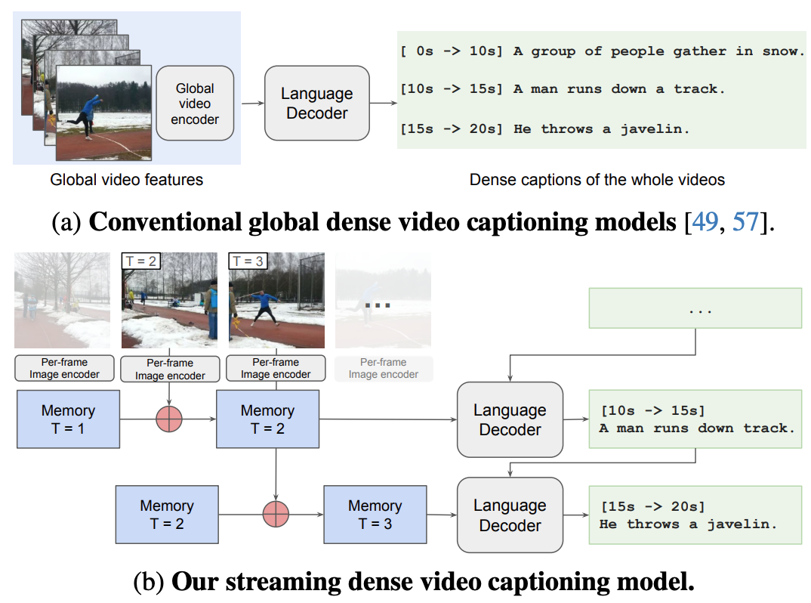

# Streaming Dense Video Captioning

> [**Streaming Dense Video Captioning**](http://arxiv.org/abs/2404.01297),\
> Xingyi Zhou*, Anurag Arnab*, Shyamal Buch, Shen Yan, Austin Myers, Xuehan Xiong, Arsha Nagrani, Cordelia Schmid. \
> *CVPR 2024*

<p align="center">  </p>

Dense Video Captioning is the task of localizing events with their starting and ending timestamps, and captioning them.
Conventional models are limited by the number of video frames which they can process, and have high latency as they produce outputs after processing the whole video.

We present a *streaming* model which:

- Streams inputs by processing frames one-at-a-time with a memory to bound computational costs irrespective of the video length.
- Streams outputs by making predictions before the entire video has been processed.

Our models achieve state-of-the-art results on ActivityNet, YouCook2 and ViTT, for which we release checkpoints.

## Getting started

First install Scenic following the instructions
[here](https://github.com/google-research/scenic#quickstart).
Then install additional dependencies with:

```
pip install -r scenic/projects/streaming_dvc/requirements.txt
```

Next, set up datasets following the instructions in [Vid2Seq](https://github.com/google-research/scenic/blob/main/scenic/projects/vid2seq/README.md#training).
This creates [TFRecord](https://www.tensorflow.org/tutorials/load_data/tfrecord) files for each dataset.
Then follow the instructions in [tools/create_densecap_json_from_tfrecord.py](tools/create_densecap_json_from_tfrecord.py)
to create ground truth files from the TFrecords for easier evaluation.

To run the [GIT](https://github.com/microsoft/GenerativeImage2Text/tree/main) backbones with the BERT tokenizer, please download the BERT vocabulary from [Huggingface](https://huggingface.co/google-bert/bert-base-uncased/blob/main/vocab.txt).

Finally, update the TFRecord path, the ground truth path, and the tokenizer path in [configs/common.py](configs/common.py).

Our GIT models are pretrained on the [WebLI dataset](https://arxiv.org/abs/2209.06794) for image captioning.
Before training a config, download the pretrained weights [here (coming soon)](), and update
`config.weights` in each config.

To train a config, e.g., `git_anet_streaming_input_output`,  run

```shell
python -m scenic.projects.streaming_dvc.main \
--config=scenic/projects/streaming_dvc/configs/git_anet_streaming_input_output.py \
--workdir=./output/git_anet_streaming_input_output/
```

To only evaluate a given checkpoint, add
`--config.eval_only=True --config.weights='/path/to/checkpoint'`
to the above command.

## Model Zoo

Dense video captioning on ActivityNet

|                        |  SODA     | CIDEr           | Checkpoint  |
|------------------------|-----------|-----------------|-------------|
| GIT                    | 5.7       |       29.8      |   -         |
| [Streaming-GIT](configs/git_anet_streaming_input_output.py)        | 6.6   |   41.2     | Coming soon    |
| Vid2Seq                | 5.9       |       30.2      |   -         |
| [Streaming-Vid2Seq](configs/vid2seq_anet_streaming_input_output.py)| 6.2   |  37.8      | Coming soon    |


Paragraph captioning on ActivityNet

|                        | CIDEr           | Checkpoint  |
|------------------------|-----------------|-------------|
| GIT                    |  32.5           |   -         |
| [Streaming-GIT](configs/git_anet_paragraph_streaming_input.py)        | 33.4 | Coming soon    |


Dense video captioning on YouCook2

|                        |  SODA     | CIDEr           | Checkpoint  |
|------------------------|-----------|-----------------|-------------|
| GIT                    | 3.1       |       12.1      |   -         |
| [Streaming-GIT](configs/git_youcook2_streaming_input_output.py)    | 3.2   |   15.4     | Coming soon    |
| Vid2Seq                | 5.7       |       25.3      |   -         |
| [Streaming-Vid2Seq](configs/vid2seq_youcook2_streaming_input_output.py)| 6.0 |  32.9   | Coming soon    |

Paragraph captioning on YouCook2

|                        | CIDEr           | Checkpoint  |
|------------------------|-----------------|-------------|
| GIT                    |  28.4           |   -         |
| [Streaming-GIT](configs/git_youcook2_paragraph_streaming_input.py)        | 33.9 | Coming soon    |

Dense video captioning on ViTT

|                        |  SODA     | CIDEr           | Checkpoint  |
|------------------------|-----------|-----------------|-------------|
| GIT                    | 7.1       |       15.1      |   -         |
| [Streaming-GIT](configs/git_vitt_streaming_input_output.py)        | 8.3   |   18.5     | Coming soon    |
| Vid2Seq                | 9.8       |       23.0      |   -         |
| [Streaming-Vid2Seq](configs/vid2seq_vitt_streaming_input_output.py)| 10.0   |  25.2      | Coming soon    |


## Citation

If you use our Streaming DVC project, please cite the following BibTeX entry:

```
@inproceedings{zhou2024streaming,
  title={Streaming Dense Video Captioning},
  author={Zhou, Xingyi and Arnab, Anurag and Buch, Shyamal and Yan, Shen and Myers, Austin and Xiong, Xuehan and Nagrani, Arsha and Schmid, Cordelia},
  booktitle={CVPR},
  year={2024}
}
```
