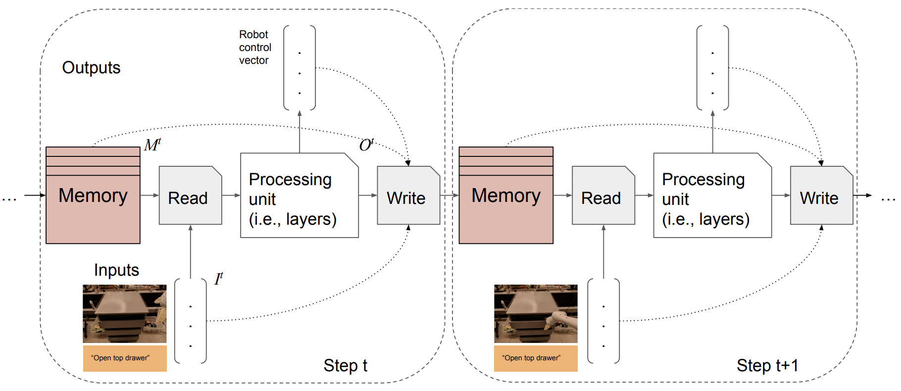

Token Turing Machines
==



Token Turing Machines (TTM) are new sequential, autoregressive Transformer
models with *external memory*. Inspired by Neural Turing Machines, TTMs have
external memories consisting of a set of tokens summarizing previous history. It
is a fully differentiable model with Transformer-based processing units and
token learning-based memory interactions, having a bounded computational cost at
each step.

It showed successful results both in computer vision (activity detection in
Charades and AVA) and robot learning (SayCan tasks). More details could be found
in the [paper](https://arxiv.org/abs/2211.09119).

## Getting Started

Currently, we are only providing the source code of the TTM module itself. Users
will need to combine this code with their own data/training pipelines.

```TokenTuringMachineEncoder``` in the [model file](model.py) is the basic
encoder applying a TTM to a fixed sized input, which essentially repeats
```TokenTuringMachineUnit```. The encoder implementation also has multiple
memory modes and processing unit supports, which are specified in the code.


## Reference

If you use TTM, please use the following BibTeX entry.

```
@InProceedings{ryoo2022ttm,
  title={Token Turing Machines},
  author={Ryoo, Michael S and Gopalakrishnan, Keerthana and Kahatapitiya, Kumara and Xiao, Ted and Rao, Kanishka and Stone, Austin and Lu, Yao and Ibarz, Julian and Arnab, Anurag},
  booktitle={arXiv preprint arXiv:2211.09119},
  year={2022}
}
```
