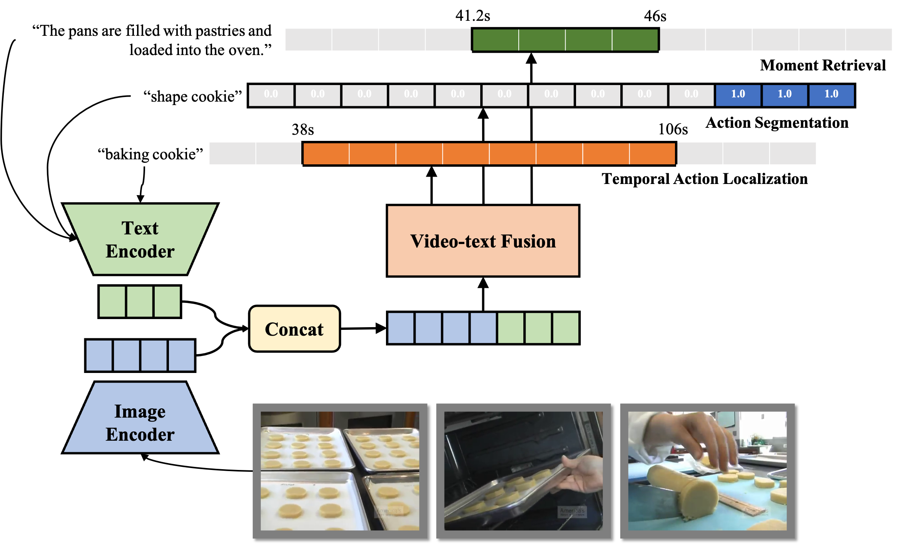

# UnLoc: A Unified Framework for Video Localization Tasks



UnLoc proposes a unified architecture for video localization tasks, e.g.,
Temporal Action Localization, Moment Retrieval, and Action Segmentation. More
details can be found in the [paper](https://openaccess.thecvf.com/content/ICCV2023/papers/Yan_UnLoc_A_Unified_Framework_for_Video_Localization_Tasks_ICCV_2023_paper.pdf).


## Reference

If you use UnLoc, please use the following BibTeX entry.

```
@inproceedings{yan2023unloc,
  title={Unloc: A unified framework for video localization tasks},
  author={Yan, Shen and Xiong, Xuehan and Nagrani, Arsha and Arnab, Anurag and Wang, Zhonghao and Ge, Weina and Ross, David and Schmid, Cordelia},
  booktitle={International Conference on Computer Vision (ICCV)},
  year={2023}
}
```
