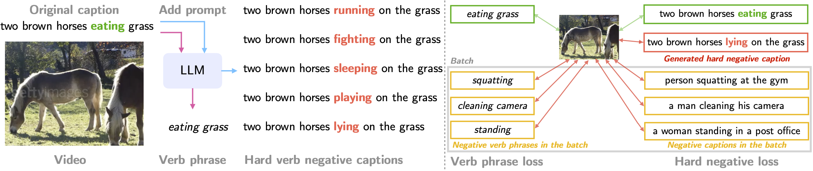

# Verbs in Action: Improving verb understanding in video-language models

JAX implementation for Verb-Focused Contrastive (VFC) learning of video-text models.
For details, see [`arXiv`](https://arxiv.org/abs/2304.06708).




## Training
Like other projects in Scenic, all model parameters, training sets and datasets are specified using [configuration files](configs).

An example command-line to train our Verb-Focused Contrastive (VFC) pre-training on the Spoken Moments in Time dataset using this [config file](configs/vfc.py) is:

```shell
$ python -m scenic.projects.verbs_in_action.main \
  --config=scenic/projects/verbs_in_action/configs/vfc.py \
  --workdir=verb_focused_contrastive/
```

Likewise, you can train a baseline model on the Spoken Moments in Time dataset. Oue baseline is a standard contrastive video-text model and corresponds to the run coined as `Baseline` for example in tables 2, 3 or 6 of our paper.
We follow this [config file](configs/baseline.py) and run:

```shell
$ python -m scenic.projects.verbs_in_action.main \
  --config=scenic/projects/verbs_in_action/configs/baseline.py \
  --workdir=baseline_contrastive/
```


## Model Zoo

<table>
  <tr>
    <th>Name</th>
    <th>Verb Human MC (acc)</th>
    <th>Kinetics-400 (top1)</th>
    <th>download</th>
    <th>config</th>
  </tr>
  <tr>
    <td>VFC</td>
    <td>80.5</td>
    <td>58.8</td>
    <td><a href="https://storage.googleapis.com/scenic-bucket/verbs_in_action/vfc_checkpoint">checkpoint</a></td>
    <td><a href="https://github.com/google-research/scenic/blob/main/scenic/projects/verbs_in_action/configs/vfc.py">config</a></td>
  </tr>
  <tr>
    <td>Baseline</td>
    <td>69.9</td>
    <td>55.6</td>
    <td><a href="https://storage.googleapis.com/scenic-bucket/verbs_in_action/baseline_checkpoint">checkpoint</a></td>
    <td><a href="https://github.com/google-research/scenic/blob/main/scenic/projects/verbs_in_action/configs/baseline.py">config</a></td>
  </tr>
</table>

Note that we are not planning to open-source the PaLM generated captions of the Spoken Moments in Time dataset.
However, all the details to reproduce the process to generate the hard negative captions with Large Language Models are included in our [paper](https://arxiv.org/abs/2304.06708).

## Kinetics-verb
We introduce the Kinetics-verb split which consists in isolating classes from the Kinetics-400 dataset that share a common noun with another class, but have a different verb.
We use this rule to create a [subset of 97 classes](kinetics-400-verb-classes.txt) from the Kinetics-400 test set.

## Citation

If you use the `verbs in action` project, please cite the following BibTeX entry:

```
@inproceedings{momeni2023verbs,
  title={Verbs in Action: Improving verb understanding in video-language models},
  author={Momeni, Liliane and Caron, Mathilde and Nagrani, Arsha and Zisserman, Andrew and Schmid, Cordelia},
  booktitle={International Conference on Computer Vision (ICCV)},
  year={2023}
}
```
