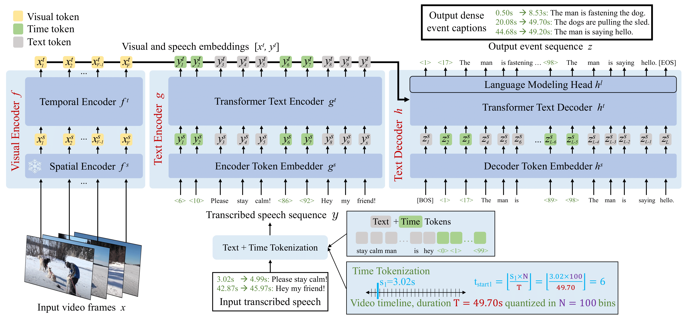

# Repository for Vid2Seq: Large-Scale Pretraining of a Visual Language Model for Dense Video Captioning

### [Project Page](https://antoyang.github.io/vid2seq.html) | [arXiv](https://arxiv.org/abs/2302.14115)



## What is Vid2Seq?

Vid2Seq is a single-stage dense video captioning model, pre-trained on narrated videos introduced in ["Vid2Seq: Large-Scale Pretraining of a Visual Language Model for Dense Video Captioning"](https://antoyang.github.io/vid2seq.html).
The model takes frames and transcribed speech from an untrimmed minutes-long video as input, and outputs dense event captions together with their temporal localization in the video by predicting a single sequence of tokens.
Pre-training is done with a generative and a denoising objective exploiting transcribed speech as pseudo dense event captioning supervision, using millions of narrated videos from YT-Temporal-1B.
More details can be found in the [paper](https://arxiv.org/abs/2302.14115) published at CVPR 2023.

## Datasets

Vid2Seq achieves state-of-the-art on standard dense event captioning benchmarks, including ActivityNet-Captions, YouCook2 and ViTT.
Vid2Seq also generalizes well to video paragraph captioning (ActivityNet-Captions, YouCook2) and the standard task of video clip captioning (MSR-VTT, MSVD).
We release the code for pretraining on YT-Temporal-1B and downstream adaptation to ActivityNet-Captions and YouCook2.
We also plan to release the corresponding pretrained model checkpoints soon.

## Training

The following command will install the required packages for Vid2Seq:
```shell
$ pip install -r scenic/projects/vid2seq/requirements.txt
```

Note that because this project relies on Scenic `train_lib_deprecated`, you need to downgrade your version of [Flax](https://github.com/google/flax) to 0.5 for compatibility.

For evaluation, you need to download captioning metrics files from [this repository](https://github.com/antoyang/captioning-metrics) and put them in the `metrics` folder. Note you will also need to download JAVA and specify the location to your Jre java bin in the [main](main.py) file.

Like other projects in Scenic, all model parameters, training sets and datasets are specified using [configuration files](configs).

To train a model, please download a pretrained T5.1.1 Base model from [T5X](https://github.com/google-research/t5x) and specify its path in [Scenic T5](https://github.com/google-research/scenic/tree/main/scenic/projects/t5).

Additionally, preprocess the dataset in the similar way as done by the ViViT project [here](https://github.com/google-research/scenic/tree/main/scenic/projects/vivit/data/data.md).
You may use the provided `generate_from_file.py` preprocessing script that handles dense captioning annotations.
There is no need to specify the number of classes in the config.
The column names of the csv file should look like the following:

| Column name            | Description                                        | Optional |
| ---------------------- | -------------------------------------------------- | -------- |
| video_id               | the video id                                       | No       |
| duration               | the duration of the video (in microseconds)        | No       |
| caption                | the list of event captions                         | No       |
| start                  | the list of event start times (in microseconds)    | No       |
| end                    | the list of event end times (in microseconds)      | No       |
| asr_string             | the list of ASR sentences                          | No       |
| asr_start              | the list of ASR start times (in microseconds)      | No       |
| asr_end                | the list of ASR end times (in microseconds)        | No       |
| features               | CLIP ViT-L/14 @ 224px at 1FPS features             | No       |

We obtained ASR sentences and corresponding temporal boundaries directly from [the Google Cloud API](https://cloud.google.com/speech-to-text/docs/automatic-punctuation), but they can also be obtained by applying an off-the-shelf punctuation model to the downloaded raw ASR data (as done in [this project](https://github.com/antoyang/just-ask) for instance).
Also note that spatially-pooled CLIP ViT-L/14 @ 224px features must be extracted at 1FPS (as done in [this project](https://github.com/antoyang/FrozenBiLM)) and added to the column name `image/clip_embeddings`.
Finally, for pretraining on YT-Temporal-1B, there is no need to prepare the columns related to the dense event captioning annotations, and features can be stored in individual files instead of directly in the csv file given the size of the dataset (see `generate_from_file.py`).

An example command-line to train Vid2Seq on YouCook2 with [config file](configs/youcook2.py) is

```shell
$ python -m scenic.projects.vid2seq.main \
  --config=scenic/projects/vid2seq/configs/youcook2.py \
  --workdir=vid2seq_base/
```


## Model Zoo

We release select pretrained Vid2Seq models trained under different settings. Checkpoints are provided as Scenic checkpoints compatible with [Flax](https://github.com/google/flax).
Note that numbers are likely to fluctuate slightly as the test sets vary when videos are taken down.


| Model           | Dataset       | SODA | Checkpoint                                                                                                                                                                                                                                         |
|:------------:|:-----------:|:---:|:----------------------------------------------------------------------------------------------------------------:|
| Vid2Seq | YT-Temporal-1B          | --- | [Checkpoint](https://storage.googleapis.com/scenic-bucket/vid2seq/yt-temporal-1b)  |
| Vid2Seq | YT-Temporal-1B + ActivityNet-Captions  | 5.8 | [Checkpoint](https://storage.googleapis.com/scenic-bucket/vid2seq/anet-captions)  |
| Vid2Seq | YT-Temporal-1B + YouCook2  | 7.7 | [Checkpoint](https://storage.googleapis.com/scenic-bucket/vid2seq/youcook-2) |

## Citation

If you use Vid2Seq, please use the following BibTeX entry.

```
@inproceedings{yang2023vid2seq,
  title={Vid2Seq: Large-Scale Pretraining of a Visual Language Model for Dense Video Captioning},
  author={Yang, Antoine and Nagrani, Arsha and Seo, Paul Hongsuck and Miech, Antoine and Pont-Tuset, Jordi and Laptev, Ivan and Sivic, Josef and Schmid, Cordelia},
  booktitle={CVPR},
  year={2023}
}
```
