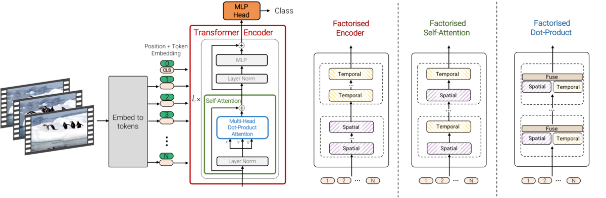

ViViT: A Video Vision Transformer
==


ViViT is a family of pure-transformer based models for video classification.
ViViT achieved state-of-the-art results on 5 different public datasets.
Details can be found in the [paper](https://arxiv.org/abs/2103.15691).

## Getting Started
The following command will install the required packages for ViViT:
```shell
$ pip install -r scenic/projects/vivit/requirements.txt
```

ViViT models and training jobs are defined by [configuration files](configs).

To train a model, please download a pretrained ViT image model trained using
[Scenic](https://github.com/google-research/scenic/tree/main/scenic/projects/baselines)
or the [original implementation](https://github.com/google-research/vision_transformer).

Additionally, pre-process the training dataset according to [here](data/data.md).

An example command-line to train ViViT-B/16x2 Factorised Encoder on Kinetics
using this [config file](configs/kinetics400/vivit_base_factorised_encoder.py)
is

```shell
$ python -m scenic.projects.vivit.main \
  --config=scenic/projects/vivit/configs/kinetics400/vivit_base_factorised_encoder.py \
  --workdir=vivit_base_factorised_encoder/
```


## Model Zoo

The following table contains pretrained ViViT models trained on various datasets.
Checkpoints are provided as Scenic checkpoints compatible with
[Flax](https://github.com/google/flax), and also as
[Tensorflow SavedModels](https://www.tensorflow.org/guide/saved_model)
for inference.

"FE" refers to ViViT Factorised Encoder models, as described in the [paper](https://arxiv.org/abs/2103.15691).
Accuracy is reported from "multi-view evaluation", as common in the literature.
In the table below, `x * y` denotes `x` temporal views, and `y` spatial views.
All the models below take in 32 frames as input.

| Model           | Dataset       | Top 1 Accuracy | Views | Config                                                                                                             | Checkpoint                                                                                                                                                                                                                                         |
|:------------:|:-----------:|:------------:|:---:|:----------------------------------------------------------------------------------------------------------------:|:------------------------------------------------------------------------------------------------------------------------------------------------------------------------------------------------------------------------------------------------:|
| ViViT-B/16x2    | Kinetics 400  | 79.9           | 4x3   | [configs/kinetics400/vivit_base_k400.py](configs/kinetics400/vivit_base_k400.py)                                   | [Checkpoint](https://storage.googleapis.com/scenic-bucket/vivit/kinetics_400/vivit_base_16x2_unfactorized/checkpoint) [SavedModel](https://storage.cloud.google.com/scenic-bucket/vivit/kinetics_400/vivit_base_16x2_unfactorized/saved_model.zip) |
| ViViT-B/16x2 FE | Kinetics 400  | 78.4           | 4x3   | [configs/kinetics400/vivit_base_factorised_encoder.py](configs/kinetics400/vivit_base_factorised_encoder.py)       | [Checkpoint](https://storage.googleapis.com/scenic-bucket/vivit/kinetics_400/vivit_base_16x2_fe/checkpoint) [SavedModel](https://storage.googleapis.com/scenic-bucket/vivit/kinetics_400/vivit_base_16x2_fe/saved_model.zip)                       |
| ViViT-L/16x2 FE | Kinetics 400  | 80.3           | 4x3   | [configs/kinetics400/vivit_large_factorised_encoder.py](configs/kinetics400/vivit_large_factorised_encoder.py)     | [Checkpoint](https://storage.googleapis.com/scenic-bucket/vivit/kinetics_400/vivit_large_16x2_fe/checkpoint) [SavedModel](https://storage.googleapis.com/scenic-bucket/vivit/kinetics_400/vivit_large_16x2_fe/saved_model.zip)                     |
| ViViT-L/16x2 FE | Kinetics 600  | 81.6           | 4x3   | [configs/kinetics600/vivit_large_factorised_encoder.py](configs/kinetics600/vivit_large_factorised_encoder.py)     | [Checkpoint](https://storage.googleapis.com/scenic-bucket/vivit/kinetics_600/vivit_large_16x2_fe/checkpoint) [SavedModel](https://storage.googleapis.com/scenic-bucket/vivit/kinetics_600/vivit_large_16x2_fe/saved_model.zip)                     |
| ViViT-L/16x2 FE | Epic Kitchens | 43.6           | 4x1   | [configs/epic_kitchens/vivit_large_factorised_encoder.py](configs/epic_kitchens/vivit_large_factorised_encoder.py) | [Checkpoint](https://storage.googleapis.com/scenic-bucket/vivit/epic_kitchens/vivit_large_16x2_fe/checkpoint) [SavedModel](https://storage.googleapis.com/scenic-bucket/vivit/epic_kitchens/vivit_large_16x2_fe/saved_model.zip)

## Other Unofficial Implementations

Feel free to share your implementation by contacting the authors or sending a
pull request.

- [Keras](https://keras.io/examples/vision/vivit/) by [Aritra Roy Gosthipaty](https://twitter.com/ariG23498) and [Ayush Thakur](https://twitter.com/ayushthakur0)

## Reference

If you use ViViT, please use the following BibTeX entry.

```
@InProceedings{arnab2021vivit,
  title={ViViT: A Video Vision Transformer},
  author={Arnab, Anurag and Dehghani, Mostafa and Heigold, Georg and Sun, Chen and Lu{\v{c}}i{\'c}, Mario and Schmid, Cordelia},
  booktitle={International Conference on Computer Vision (ICCV)},
  year={2021}
}
```
